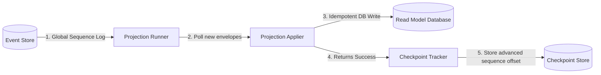

In a local test application, replaying all events in-memory upon every request is perfectly fine. However, in a production system with millions of events, we cannot perform full in-memory replays of our entire ledger to satisfy queries.

To scale queries, we persist our read models inside database tables and run background **Projection Runners** that sequentially process events and manage **Checkpoints**. See [Database Query Patterns](./db-query-patterns.md) for the exact event-store indexes, read-model query rules, and consistency tradeoffs.

---

## The Checkpointing System

To ensure our read models never duplicate work or lose track of where they are, we use **Checkpoints**:
1. Every event successfully committed to the database receives a monotonically increasing global `sequence` number.
2. The Projection Runner maintains a separate checkpoint table (e.g., `projection_checkpoints`) which stores a single number representing the last global `sequence` successfully processed by that specific projection.
3. Upon startup or loop execution, the runner reads its stored checkpoint, queries the event store for any events with `sequence > checkpoint`, processes those new events, and updates its checkpoint.

---

## Asynchronous Projection Pipeline

This architecture completely decouples write transactions from read calculations, enabling horizontal write scaling and instant read-model lookups:



---

## Production Reliability Rules

When implementing production-grade projections, you must strictly adhere to these two rules:

### Rule 1: Projections MUST be Idempotent
If your application server crashes or loses network connectivity mid-transaction, the projection runner will restart and retry applying the last block of events. 

Your projection code must handle processing the same event multiple times without corrupting your read model data. For example:
* **SQL Upsert:** Use `INSERT INTO ... ON CONFLICT (id) DO UPDATE ...` instead of a blind `INSERT`.
* **Saturating Arithmetic:** Ensure operations like subtraction use defensive helpers (e.g., `saturating_sub`) to prevent arithmetic underflows.

### Rule 2: Projections MUST be Sequential
Events must be processed in the exact order they were committed. Processing events out of order can lead to corrupted read states (such as attempting to apply `MoneyDeposited` before `AccountOpened`).

Our Projection Runner guarantees sequential processing by executing in a single thread per projection pipeline, reading events ordered strictly by their global database `sequence`.

---

## Building a Persisted Projection Runner

To run a persisted projection in production, you can use the built-in `PersistedProjectionRunner` (for synchronous event stores) or `AsyncPersistedProjectionRunner` (for async event stores), paired with a checkpoint store (such as `SqliteCheckpointStore` or `PostgresCheckpointStore`).

Use `run_batch(...)` for production workers so each loop loads a bounded
backlog slice. The compatibility `run(...)` methods still exist, but they load
all events after the checkpoint and should be reserved for tests, small local
tools, or one-off maintenance jobs where the backlog size is known.

### Example: Sync Sqlite Projection Runner

```rust
use ddd_cqrs_es::{
    SqliteEventStore, SqliteCheckpointStore, PersistedProjectionRunner,
    ProjectionBatchConfig,
};

fn run_my_projection(
    event_store: &SqliteEventStore<BankAccount>,
    connection: rusqlite::Connection,
) -> Result<(), Box<dyn std::error::Error>> {
    // 1. Set up the checkpoint store database tables
    let checkpoint_store = SqliteCheckpointStore::new(connection)?;
    checkpoint_store.initialize_schema()?;

    // 2. Wrap your custom projection with the runner
    let mut runner = PersistedProjectionRunner::new(
        MyBankAccountProjection::new(),
        checkpoint_store,
    );

    // 3. Trigger a projection poll run
    // This loads events after the stored checkpoint, applies them, and then
    // advances the checkpoint for each successful event sequence.
    // Projection writes and checkpoint writes are not one transaction, so the
    // projection must be idempotent.
    let outcome = runner.run_batch(event_store, ProjectionBatchConfig::default())?;
    println!("Processed {} new events", outcome.applied);

    Ok(())
}
```

### Example: Sync Postgres Projection Runner

```rust
use ddd_cqrs_es::{
    PostgresEventStore, PostgresCheckpointStore, PersistedProjectionRunner,
    ProjectionBatchConfig,
};

fn run_my_postgres_projection(
    event_store: &PostgresEventStore<BankAccount>,
    checkpoint_store: PostgresCheckpointStore,
) -> Result<(), Box<dyn std::error::Error>> {
    let mut runner = PersistedProjectionRunner::new(
        MyBankAccountProjection::new(),
        checkpoint_store,
    );

    // Trigger a projection poll run.
    let outcome = runner.run_batch(event_store, ProjectionBatchConfig::default())?;
    println!("Processed {} new events", outcome.applied);

    Ok(())
}
```
