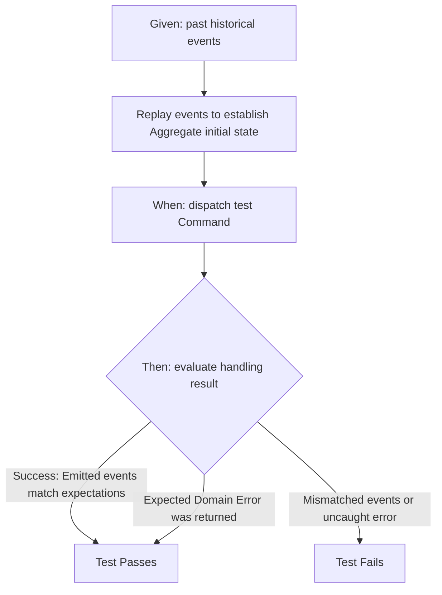

One of the most powerful benefits of Event Sourcing is how it transforms your unit testing capabilities. 

In a traditional CRUD system, writing unit tests for complex business rules is painful. You have to write extensive setup code, mock out databases or network clients, pre-populate schema rows, execute the action, and then query the database to assert that the state changed correctly.

In an **Event Sourced** system, you have a **unit-testing superpower**:
* establishing the pre-conditions of your system (the **`Given`** block) requires zero database setup or complex mocking. You simply provide an array of past historical events.
* You then dispatch the command representing the action (the **`When`** block).
* Finally, you assert that the expected new historical events were emitted, or that a specific domain validation error was raised (the **`Then`** block).

---

## The Given-When-Then BDD Pipeline

Because `Aggregate::apply` and `Aggregate::handle` are pure, synchronous Rust functions without side effects, your unit tests are completely deterministic and execute in microseconds:



---

## Complete Aggregate Test Suite

We provide a streamlined test helper called `AggregateFixture` to make writing BDD aggregate tests as simple as possible.

Here is a complete test suite testing our Bank Account aggregate's business rules using our actual testing helper:

```rust
use ddd_cqrs_es::testing::AggregateFixture;

#[cfg(test)]
mod tests {
    use super::*;

    #[test]
    fn test_successful_bank_account_lifecycle() {
        let account_id = "account-123".to_owned();

        // Scenario 1: Opening a new account emits AccountOpened
        AggregateFixture::<BankAccount>::new()
            .given(vec![]) // Establish no pre-existing events
            .when(BankAccountCommand::OpenAccount {
                account_id: account_id.clone(),
                owner: "Uriah".to_owned(),
            })
            .then_expect_events(vec![BankAccountEvent::AccountOpened {
                account_id: account_id.clone(),
                owner: "Uriah".to_owned(),
            }])
            .then_expect_revision(1); // Aggregate should now be at revision 1

        // Scenario 2: Depositing money on an open account succeeds
        AggregateFixture::<BankAccount>::new()
            .given(vec![
                // 1. Establish the history: the account is already open
                BankAccountEvent::AccountOpened {
                    account_id: account_id.clone(),
                    owner: "Uriah".to_owned(),
                }
            ])
            .when(BankAccountCommand::DepositMoney { amount: 500 })
            .then_expect_events(vec![BankAccountEvent::MoneyDeposited { amount: 500 }])
            .then_expect_revision(2); // History has 1 event + 1 new event = revision 2
    }

    #[test]
    fn test_failed_business_rule_validations() {
        let account_id = "account-123".to_owned();

        // Scenario 1: Cannot deposit money on an account that has not been opened yet
        AggregateFixture::<BankAccount>::new()
            .given(vec![]) // No history
            .when(BankAccountCommand::DepositMoney { amount: 100 })
            .then_expect_error(BankAccountError::AccountNotYetOpen);

        // Scenario 2: Cannot withdraw more money than the current available balance
        AggregateFixture::<BankAccount>::new()
            .given(vec![
                // Replay history to establish a balance of $100
                BankAccountEvent::AccountOpened {
                    account_id: account_id.clone(),
                    owner: "Uriah".to_owned(),
                },
                BankAccountEvent::MoneyDeposited { amount: 100 },
            ])
            .when(BankAccountCommand::WithdrawMoney { amount: 150 }) // Attempting to withdraw $150
            .then_expect_error(BankAccountError::InsufficientFunds {
                available: 100,
                requested: 150,
            });
    }
}
```

---

## Benefits of BDD Aggregate Testing

By utilizing `AggregateFixture`:
1. **No External Dependencies:** You do not need to boot Docker database containers, mock HTTP servers, or configure test database schemas to assert that your business rules are correct.
2. **Instant Feedback Loop:** Hundreds of business scenarios can execute in a fraction of a second, boosting developer confidence and enabling fast CI/CD pipelines.
3. **Living Documentation:** The test cases read exactly like business specifications, matching the Ubiquitous Language defined with domain experts.
