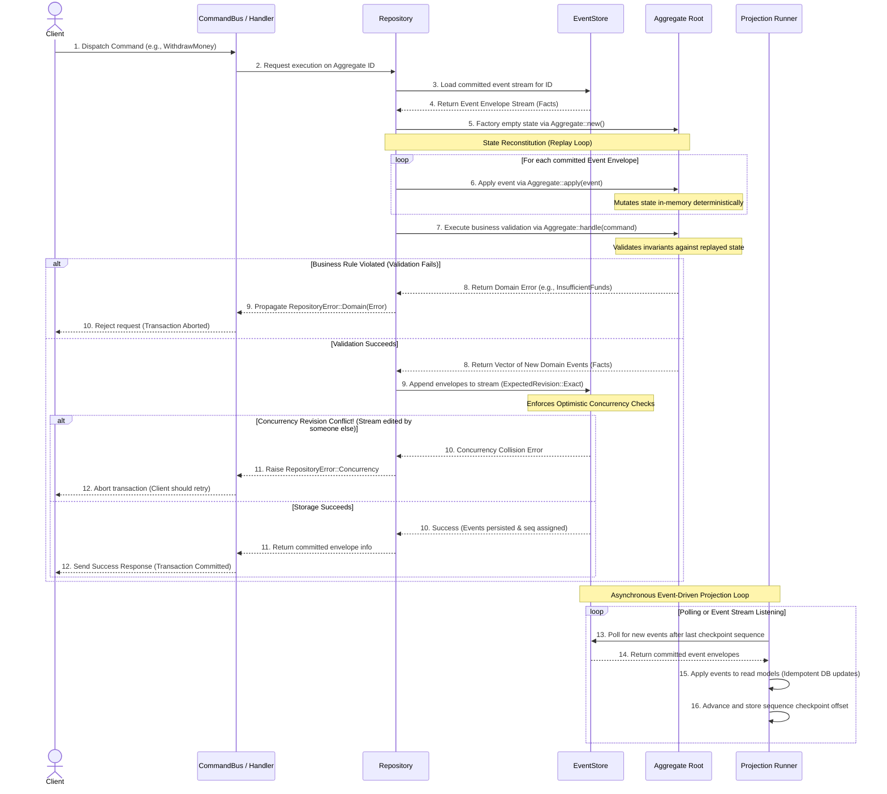

In a traditional database-driven application (such as CRUD), state is mutated destructively. When a customer withdraws money, you overwrite their balance in a database table. You lose the context of *how* and *when* that state was reached.

In an **Event Sourced** system, we never mutate state directly. Instead, we represent every change to our application as an immutable, sequential log of historical facts called an **Event Stream**.

---

## State Reconstitution (Replay)

To determine the current state of an entity, the system does not read a single mutated row. Instead:
1. It loads the entire stream of past committed events belonging to that specific Aggregate ID from an append-only store.
2. It initializes an empty instance of the aggregate in memory.
3. It replays each event in-order through the aggregate's deterministic `apply` method.

Because the historical events are immutable, replaying them will always reconstitute the exact, correct state of the aggregate root, ensuring high reliability and auditability.

---

## The Command Execution Lifecycle

The following sequence diagram illustrates the complete, end-to-end lifecycle of a client dispatching a command to execute a transaction, persisting the resulting event facts, and asynchronously updating the query models:

---

## Why Event Sourcing?

By building your core around event streams, you receive several powerful architectural benefits:

* **Auditability:** You have an indisputable, complete history of everything that has ever occurred in your domain. Excellent for compliance, business intelligence, and security audits.
* **Deterministic Bug Reproduction:** If a production error occurs, you can fetch that aggregate's event stream, load it into a local unit test, and replay it. You will replicate the exact in-memory state of the aggregate at that moment, letting you debug and resolve issues rapidly.
* **Temporal Querying:** You can reconstituted state to any point in time. If you want to know what a customer's account looked like exactly on January 1st, 2026, you simply replay only the events committed prior to that date.
